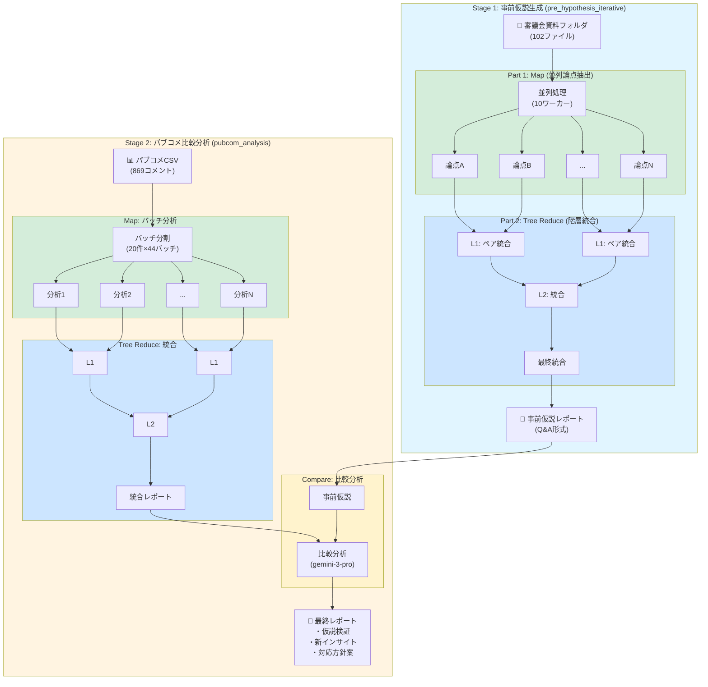

# i-1-grand-prix

市民対話セッション・パブリックコメント等のデータを分析し、Google Gemini API を用いて客観的なレポートを生成するツールです。

## 概要

このプロジェクトは、審議会資料やパブリックコメントCSVデータを入力として受け取り、以下の2段階パイプラインで分析レポートを生成します：

### 推奨パイプライン（2段階）



| モード | 目的 | 入力 | 出力 |
|--------|------|------|------|
| `pre_hypothesis_iterative` | 審議会資料からQ&A形式の事前仮説を生成 | 審議会資料フォルダ | 事前仮説レポート |
| `pubcom_analysis` | パブコメを事前仮説と比較分析 | パブコメCSV + 事前仮説 | 最終比較レポート |

### このツールの目的

**事前仮説（審議会での議論）とくらべて、パブリックコメント等に新しいビュー（視点・論点）がないかを見出すこと**を主眼としています。

## 特徴

- **Tree Reduce パイプライン**: 大量データを効率的に並列処理して統合
- **バッチ並列処理**: Map/Reduce パターンで高速処理
- **チェックポイント機能**: 中断からの再開が可能
- **複数AIモデル対応**: Gemini Flash, Gemini Pro など用途に応じて切り替え
- **詳細なメタデータ記録**: 処理過程を完全にトレース可能

## セットアップ

### 必要な環境

- Python 3.8以上
- Google Cloud API Key (Gemini API)

### インストール

```bash
git clone <repository-url>
cd i-1-grand-prix
pip install -r requirements.txt
```

### 環境変数の設定

`.env` ファイルをプロジェクトルートに作成：

```bash
GOOGLE_API_KEY=your_google_api_key_here
```

## 使い方

### 1. 事前仮説生成 (`pre_hypothesis_iterative`)

審議会資料から構造化された事前仮説レポートを生成します。

```bash
python -m src.interview_analysis.cli \
  --mode pre_hypothesis_iterative \
  --source-dir "path/to/committee/documents" \
  --focus "船荷証券の電子化" \
  --model gemini-flash-latest
```

**処理フロー:**
1. **Part 1 (Map)**: 各ドキュメントから論点を抽出（並列処理）
2. **Part 2 (Tree Reduce)**: 論点を階層的に統合してQ&Aリスト生成

**出力例:**
```
doc/2025-12-05/run-111834/outputs/report.md
├─ 1. 主要な事前仮説・論点
├─ 2. Q&A形式での論点整理
├─ 3. 反対意見・懸念点
├─ 4. 検討課題
└─ 処理メタデータ
```

### 2. パブコメ比較分析 (`pubcom_analysis`)

パブリックコメントを事前仮説と比較し、仮説の検証・新インサイトを抽出します。

```bash
python -m src.interview_analysis.cli \
  --mode pubcom_analysis \
  --csv data/comments.csv \
  --previous-report doc/2025-12-05/run-111834/outputs/report.md \
  --focus "船荷証券の電子化" \
  --model gemini-flash-latest \
  --comparison-model gemini-3-pro-preview
```

**処理フロー:**
1. **Map**: 各コメントを分析してバッチ処理（並列）
2. **Tree Reduce**: 分析結果を階層的に統合
3. **Compare**: 事前仮説と比較して最終レポート生成

**オプション:**
- `--model`: Map/Reduce フェーズで使用するモデル（高速処理向け）
- `--comparison-model`: Compareフェーズで使用するモデル（高品質向け）

**出力例:**
```
doc/2025-12-05/run-113027/outputs/report.md
├─ 1. パブリックコメントによる仮説の検証
├─ 2. パブリックコメントによる反対・懸念の顕在化
├─ 3. 新たなインサイト・論点
├─ 4. 今後の対応方針案
├─ 参考: パブリックコメント集約レポート
└─ 処理メタデータ（両パイプライン統合）
```

### オプション一覧

| オプション | デフォルト | 説明 |
|-----------|----------|------|
| `--mode` | - | 実行モード (`pre_hypothesis_iterative`, `pubcom_analysis`) |
| `--source-dir` | - | 審議会資料フォルダ（pre_hypothesis用） |
| `--csv` | - | パブコメCSVファイルパス |
| `--previous-report` | - | 事前仮説レポートパス（pubcom_analysis用） |
| `--focus` | - | 分析の主眼となるテーマ |
| `--model` | `gemini-flash-lite-latest` | 使用するモデル |
| `--comparison-model` | - | 比較フェーズ専用モデル |
| `--temperature` | 0.3 | 生成温度 (0.0-1.0) |
| `--max-output-tokens` | 64000 | 最大出力トークン数 |
| `--log-dir` | `doc` | ログ出力先ディレクトリ |

## パイプライン詳細

### Tree Reduce アルゴリズム

大量データを効率的に統合するため、ペアワイズの階層的統合を行います：

```
Level 1: [A, B, C, D, E, F, G, H] → [AB, CD, EF, GH]  (4ペア並列)
Level 2: [AB, CD, EF, GH]       → [ABCD, EFGH]       (2ペア並列)
Level 3: [ABCD, EFGH]           → [ABCDEFGH]         (1ペア)
         ↓
       最終レポート
```

### チェックポイント機能

処理が中断された場合、`doc/checkpoints/` に保存されたチェックポイントから再開できます：

```bash
# 同じコマンドを再実行すると、チェックポイントから継続
python -m src.interview_analysis.cli --mode pubcom_analysis ...
```

チェックポイントをクリアして最初から実行する場合：
```bash
Remove-Item -Recurse -Force "doc\checkpoints\*"
```

## ディレクトリ構成

```
i-1-grand-prix/
├── config/
│   └── meta.yaml                # メタ情報設定（レガシー）
├── data/                        # 入力データ（CSV等）
├── doc/                         # 実験ログ出力先
│   ├── checkpoints/             # 中間チェックポイント
│   └── YYYY-MM-DD/
│       └── run-HHMMSS/
│           ├── config.json      # 実行設定
│           └── outputs/
│               └── report.md    # 生成レポート
├── prompts/                     # プロンプトテンプレート
│   ├── pre_hypothesis_part1.md  # 論点抽出用
│   ├── pre_hypothesis_reduce.md # Q&A統合用
│   ├── pubcom_map.md            # パブコメ分析用
│   ├── pubcom_reduce.md         # パブコメ統合用
│   └── pubcom_comparison.md     # 比較分析用
├── src/
│   └── interview_analysis/      # メインモジュール
│       ├── cli.py               # CLIエントリポイント
│       ├── pipeline.py          # 実行パイプライン
│       ├── prompts.py           # プロンプト処理
│       ├── loader.py            # データローダー
│       └── model_provider.py    # モデルプロバイダー
├── scraping/                    # Webスクレイピング
│   └── scraper.py               # スクレイパー
├── .env                         # 環境変数（要作成）
├── CLAUDE.md                    # AIアシスタント向けガイドライン
├── requirements.txt             # Python依存パッケージ
└── README.md
```

## 出力形式

### 処理メタデータ

レポート末尾に処理過程の詳細が記録されます：

```markdown
## 処理パイプライン: パブリックコメント分析 (pubcom_analysis)

### Map (コメント分析)
- **入力**: 869 → **出力**: 44
- **モデル**: `gemini-flash-latest`
- **詳細**: 44バッチ (並列5ワーカー)

### Tree Reduce (統合)
- **入力**: 15 → **出力**: 1
- **モデル**: `gemini-flash-latest`
- **詳細**: 4レベル並列

### Compare (比較分析)
- **モデル**: `gemini-3-pro-preview`
```

## トラブルシューティング

### PDF処理時の警告
`Advanced encoding /90msp-RKSJ-H not implemented yet` 等の警告が出ることがありますが、テキスト抽出自体は正常に動作します。無視して問題ありません。

### API レスポンスの警告
`Warning: there are non-text parts in the response` は Gemini API の軽微な警告で、処理に影響しません。

### チェックポイントの破損
チェックポイントに問題がある場合は、`doc/checkpoints/` 内の該当ディレクトリを削除して再実行してください。

## ライセンス

(ライセンス情報をここに記載)

## お問い合わせ

(お問い合わせ先をここに記載)
