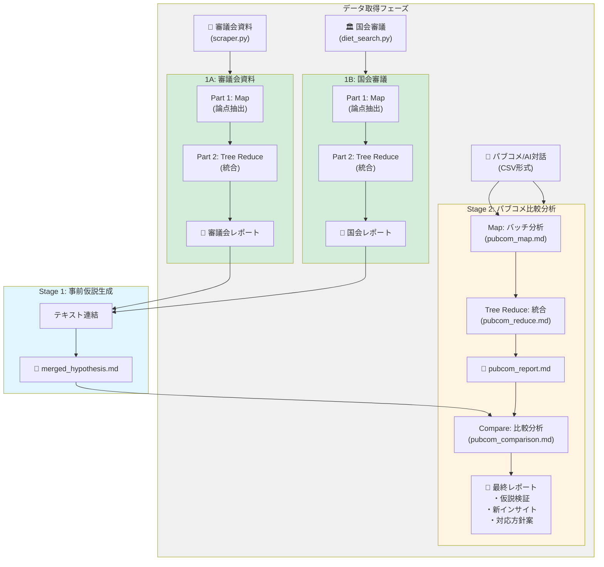

# i-1-grand-prix

市民対話セッション・パブリックコメント等のデータを分析し、Google Gemini API を用いて客観的なレポートを生成するツールです。

## 概要

> このプロジェクトは、審議会資料・国会審議・パブリックコメントを入力として受け取り、以下の3段階パイプラインで分析レポートを生成します：

### 推奨パイプライン（3段階構成）


```mermaid
graph TB
    subgraph DataAcquisition ["データ取得フェーズ"]
        D1["📁 審議会資料<br/>(scraper.py)"] --> Stage1A
        D2["🏛️ 国会審議<br/>(diet_search.py)"] --> Stage1B
        D3["💬 パブコメ/AI対話<br/>(CSV形式)"] --> Stage2
    end

    subgraph Stage1 ["Stage 1: 事前仮説生成"]
        subgraph Stage1A ["1A: 審議会資料"]
            S1A_Map["Part 1: Map<br/>(論点抽出)"] --> S1A_Reduce["Part 2: Tree Reduce<br/>(統合)"]
            S1A_Reduce --> S1A_Out["📄 審議会レポート"]
        end
        
        subgraph Stage1B ["1B: 国会審議"]
            S1B_Map["Part 1: Map<br/>(論点抽出)"] --> S1B_Reduce["Part 2: Tree Reduce<br/>(統合)"]
            S1B_Reduce --> S1B_Out["📄 国会レポート"]
        end
        
        S1A_Out --> Concat["テキスト連結"]
        S1B_Out --> Concat
        Concat --> MergedHypothesis["📄 merged_hypothesis.md"]
    end

    subgraph Stage2 ["Stage 2: パブコメ比較分析"]
        D3 --> S2Map["Map: バッチ分析<br/>(pubcom_map.md)"]
        S2Map --> S2Reduce["Tree Reduce: 統合<br/>(pubcom_reduce.md)"]
        S2Reduce --> S2Report["📄 pubcom_report.md"]
        
        MergedHypothesis --> S2Compare["Compare: 比較分析<br/>(pubcom_comparison.md)"]
        S2Report --> S2Compare
        S2Compare --> FinalReport["📝 最終レポート<br/>・仮説検証<br/>・新インサイト<br/>・対応方針案"]
    end

    style DataAcquisition fill:#f0f0f0
    style Stage1 fill:#e1f5ff
    style Stage1A fill:#d4edda
    style Stage1B fill:#d4edda
    style Stage2 fill:#fff4e1
```

### このツールの目的

**事前仮説（審議会・国会での議論）とくらべて、パブリックコメント等に新しいビュー（視点・論点）がないかを見出すこと**を主眼としています。

## 特徴

- **Tree Reduce パイプライン**: 大量データを効率的に並列処理して統合
- **バッチ並列処理**: Map/Reduce パターンで高速処理
- **チェックポイント機能**: 中断からの再開が可能
- **複数AIモデル対応**: Gemini Flash, Gemini Pro, OpenRouter経由のモデル
- **Citation Registry**: 出典情報の追跡とURLリンク自動展開
- **トークン使用量追跡**: APIコスト管理のための詳細なログ

## セットアップ

### 必要な環境

- Python 3.8以上
- Google Cloud API Key (Gemini API)

### インストール

```bash
git clone <repository-url>
cd i-1-grand-prix
pip install -r requirements.txt
```

### 環境変数の設定

`.env` ファイルをプロジェクトルートに作成：

```bash
GOOGLE_API_KEY=your_google_api_key_here
```

## データ取得

### 審議会資料のスクレイピング

```bash
python scraping/scraper.py <URL> \
  --output_dir <ダウンロード先> \
  --path-prefix <パス> \
  [--filter <キーワード>] \
  [--link-text-filter <リンクテキスト>]
```

- 2階層までクロール
- 対象形式: txt, pptx, xlsx, doc, docx, pdf
- `--path-prefix` は必須（例: `/shingi1/` または `none`）
- 出力: ドキュメントファイル + `metadata_*.json`

### 国会審議の取得

```bash
# 会議検索 + 議事録ダウンロード
python scripts/diet_search.py \
  --keyword "人工知能基本計画" \
  --from 2015-01-01 \
  --until 2025-12-10 \
  --output-dir each_project/ai-plan-test/kokkai \
  --output meetings.tsv \
  --download

# CSVに変換（pre_hypothesis_iterativeで使用するため）
python scripts/convert_transcripts_to_csv.py \
  --input-dir each_project/ai-plan-test/kokkai/meetings_* \
  --output each_project/ai-plan-test/kokkai/diet_speeches.csv
```

出力ファイル:
- `meetings_*.tsv`: 会議メタデータ
- `meetings_*/`: 議事録テキスト
- `diet_speeches.csv`: 分析用CSV（session_id, speech_id, speaker, speech列）

## Stage 1: 事前仮説生成

### Stage 1A: 審議会資料から事前仮説

```bash
python -m src.interview_analysis.cli \
  --mode pre_hypothesis_iterative \
  --source-dir "each_project/ai-plan-test/shingikai" \
  --focus "人工知能基本計画" \
  --model "gemini:gemini-flash-lite-latest"
```

### Stage 1B: 国会審議から事前仮説

```bash
python -m src.interview_analysis.cli \
  --mode pre_hypothesis_iterative \
  --source-dir "each_project/ai-plan-test/kokkai" \
  --focus "人工知能基本計画" \
  --model "gemini:gemini-flash-lite-latest"
```

**処理フロー:**
- **Part 1 (Map)**: 各ドキュメントから論点を並列抽出（`pre_hypothesis_part1.md`）
- **Part 2 (Tree Reduce)**: 階層的統合でYAML形式Q&Aリスト生成（`pre_hypothesis_part2_iterative.md`）

### 事前仮説の統合（Concat方式）

審議会と国会のレポートを**単純なテキスト連結**で統合:

```powershell
# PowerShell
Get-Content doc/2025-12-15/run-A/outputs/report.md, doc/2025-12-15/run-B/outputs/report.md | Set-Content merged_hypothesis.md
```

- `pubcom_comparison` は複数の YAML ブロックを入力として理解可能

## Stage 2: パブコメ比較分析

### 一括実行（pubcom_analysis）

```bash
python -m src.interview_analysis.cli \
  --mode pubcom_analysis \
  --csv data/comments.csv \
  --previous-report doc/2025-12-15/merged_hypothesis.md \
  --focus "人工知能基本計画" \
  --model "gemini:gemini-flash-lite-latest" \
  --comparison-model "gemini:gemini-2.0-flash"
```

**処理フロー:**
- **Map**: パブコメをバッチ分析（`pubcom_map.md`）
- **Tree Reduce**: 分析結果を階層的統合（`pubcom_reduce.md`）
- **Compare**: 事前仮説との比較レポート生成（`pubcom_comparison.md`）

### 分離実行（大量データ向け）

#### Step 2a: パブコメ集約のみ

```bash
python -m src.interview_analysis.cli \
  --mode pubcom_aggregate \
  --csv data/comments.csv \
  --focus "人工知能基本計画" \
  --model "gemini:gemini-flash-lite-latest" \
  --max-map-batches 50  # APIクォータ管理
```

出力: `pubcom_report.md`（YAML形式、再利用可能）

#### Step 2b: 比較分析のみ

```bash
python -m src.interview_analysis.cli \
  --mode pubcom_compare \
  --pubcom-report doc/2025-12-15/run-HHMMSS/outputs/pubcom_report.md \
  --prior-hypothesis doc/2025-12-15/merged_hypothesis.md \
  --focus "人工知能基本計画" \
  --comparison-model "gemini:gemini-2.0-flash"
```

**推奨モデル構成:**
- `--model "gemini:gemini-flash-lite-latest"`: Map/Reduce（高速・低コスト）
- `--comparison-model "gemini:gemini-2.0-flash"`: Compare（高品質）

## モデルプロバイダー指定

モデル名にプレフィックスを付けてプロバイダーを明示指定:

| プレフィックス | プロバイダー | 例 |
|---------------|------------|-----|
| `gemini:` | Google Gemini API | `gemini:gemini-flash-lite-latest` |
| `openrouter:` | OpenRouter API | `openrouter:x-ai/grok-4.1-fast:free` |
| なし | Gemini（後方互換） | `gemini-flash-lite-latest` |

## オプション一覧

| オプション | デフォルト | 説明 |
|-----------|-----------|------|
| `--mode` | - | 実行モード |
| `--source-dir` | - | 審議会/国会資料フォルダ（pre_hypothesis用） |
| `--csv` | - | パブコメCSVファイルパス |
| `--previous-report` | - | 事前仮説レポートパス（pubcom_analysis用） |
| `--focus` | - | 分析の主眼となるテーマ |
| `--model` | `gemini-flash-lite-latest` | Map/Reduceで使用するモデル |
| `--comparison-model` | - | 比較フェーズ専用モデル |
| `--temperature` | 0.0 | Map/Reduceフェーズの生成温度 |
| `--comparison-temperature` | 1.0 | Comparisonフェーズの生成温度 |
| `--max-output-tokens` | 64000 | 最大出力トークン数 |
| `--max-map-batches` | - | Mapフェーズの最大バッチ数（API制限対策） |
| `--log-dir` | `doc` | ログ出力先ディレクトリ |
| `--pubcom-report` | - | pubcom_compare用: 集約済みパブコメレポート |
| `--prior-hypothesis` | - | pubcom_compare用: 事前仮説レポート |
| `--merged-hypothesis` | - | 引用ID解決用の統合仮説ファイル |

## 出力ファイル

| ファイル | 内容 |
|---------|------|
| `report_{mode}.md` | 通常のレポート（引用タグのみ） |
| `report_{mode}_with_references.md` | URLリンク展開版レポート |
| `citation_registry.json` | 全引用情報のJSON |
| `pubcom_report.md` | パブコメ集約レポート（再利用可能） |
| `token_usage.jsonl` | トークン使用量ログ |

## ディレクトリ構成

```
i-1-grand-prix/
├── config/
│   └── meta.yaml                # メタ情報設定（レガシー）
├── data/                        # 入力データ（CSV等）
├── doc/                         # 実験ログ出力先
│   ├── checkpoints/             # 中間チェックポイント
│   └── YYYY-MM-DD/
│       └── run-HHMMSS/
│           ├── config.json      # 実行設定
│           ├── token_usage.jsonl # トークン使用量
│           └── outputs/
│               ├── report.md    # 生成レポート
│               ├── report_with_references.md  # リンク展開版
│               ├── citation_registry.json     # 出典情報
│               └── pubcom_report.md           # パブコメ集約
├── each_project/                # プロジェクト別データ
│   └── <project-name>/
│       ├── shingikai/           # 審議会資料
│       └── kokkai/              # 国会審議資料
├── prompts/                     # プロンプトテンプレート
│   ├── pre_hypothesis_part1.md  # 論点抽出用
│   ├── pre_hypothesis_part2_iterative.md  # 論点統合用
│   ├── pubcom_map.md            # パブコメ分析用
│   ├── pubcom_reduce.md         # パブコメ統合用
│   ├── pubcom_comparison.md     # 比較分析用
│   └── legacy/                  # 旧プロンプト
├── scripts/                     # ユーティリティスクリプト
│   ├── diet_search.py           # 国会審議検索
│   ├── diet_download.py         # 議事録ダウンロード
│   └── convert_transcripts_to_csv.py  # CSV変換
├── scraping/                    # Webスクレイピング
│   └── scraper.py               # スクレイパー
├── src/
│   └── interview_analysis/      # メインモジュール
│       ├── cli.py               # CLIエントリポイント
│       ├── pipeline.py          # 実行パイプライン
│       ├── citation.py          # 出典管理
│       ├── loader.py            # データローダー
│       ├── model_provider.py    # モデルプロバイダー
│       └── token_tracker.py     # トークン追跡
├── .env                         # 環境変数（要作成）
├── claude.md                    # AIアシスタント向けガイドライン
├── requirements.txt             # Python依存パッケージ
└── README.md
```

## チェックポイント機能

処理が中断された場合、`doc/checkpoints/` から再開可能。

```bash
# チェックポイントをクリアして最初から実行
Remove-Item -Recurse -Force "doc\checkpoints\*"
```

## トラブルシューティング

### PDF処理時の警告

`Advanced encoding /90msp-RKSJ-H not implemented yet` 等の警告が出ることがありますが、テキスト抽出自体は正常に動作します。無視して問題ありません。

### API レスポンスの警告

`Warning: there are non-text parts in the response` は Gemini API の軽微な警告で、処理に影響しません。

### チェックポイントの破損

チェックポイントに問題がある場合は、`doc/checkpoints/` 内の該当ディレクトリを削除して再実行してください。

### focus フィルタリング

`--focus` 引数で指定したテーマに**直接関係のない論点は除外**される:
- 別テーマの政策議論（税制、社会保障、エネルギー等）
- 背景として軽く触れられているだけの論点
- 判断基準: その論点がfocusの実現・決定に**直接影響を与えるか**

## ライセンス

(ライセンス情報をここに記載)

## お問い合わせ

(お問い合わせ先をここに記載)
